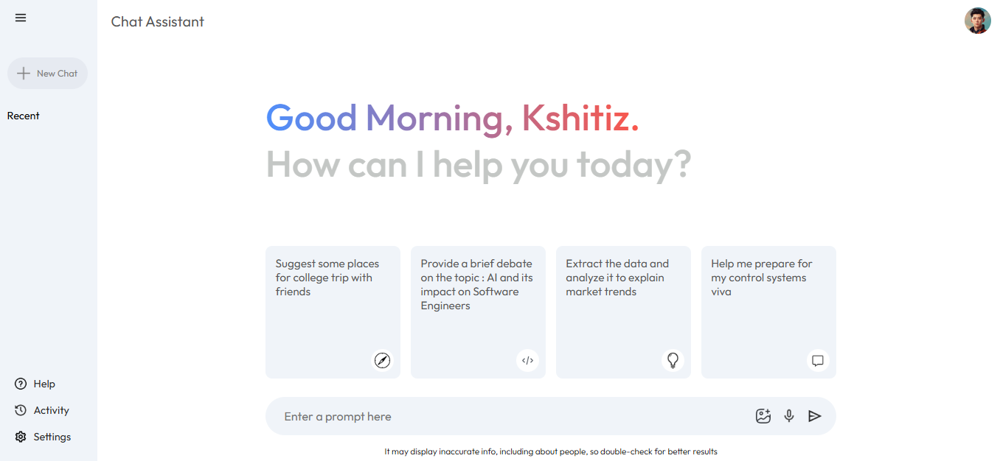
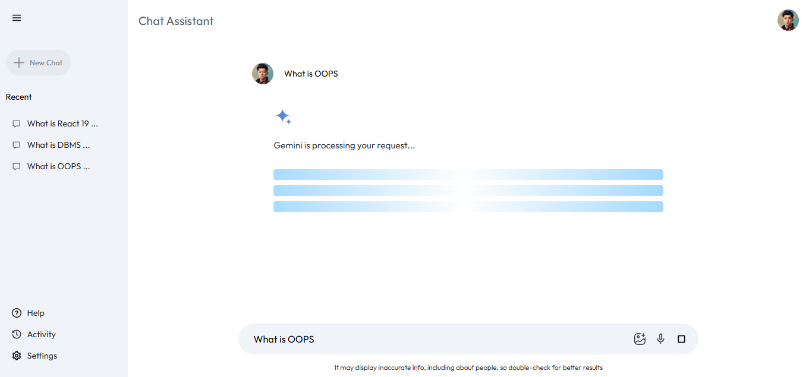
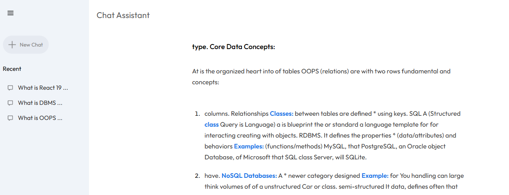
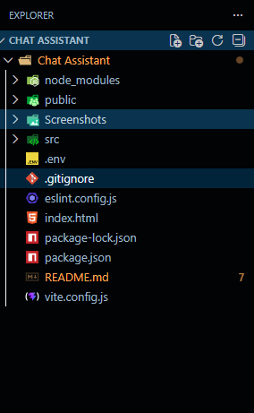

# 🤖 Intelligent AI Chat Assistant

An advanced, high-performance conversational interface built with **React.js** and the **Google Gemini Pro** model. This project focuses on solving complex asynchronous UI challenges, such as real-time stream interruption and synchronized state management across a modular architecture.

---

## 🌟 Technical Highlights

### 🎙️ Multimodal Input (Speech-to-Text)
Integrated the **Web Speech API** to enable seamless, hands-free communication. The application dynamically transcribes user speech into the input buffer, providing a fluid alternative to traditional text entry.

### 🛑 Interruptible Response Stream (The "Kill-Switch")
Implemented a robust "Stop Generation" feature using **React `useRef` hooks**. 
* **The Challenge:** Standard `setTimeout` loops in React often suffer from "stale closures," making them unresponsive to state changes once triggered.
* **The Solution:** By utilizing a mutable Ref as a global flag, the application can instantly break out of the typewriter animation loop, ensuring immediate UI responsiveness.

### ⏱️ Dynamic Performance Metrics

* **Read-Time Estimation:** Analyzes real-time AI output to provide a live "Estimated Read Time" based on word count metrics.
* **Optimized Rendering:** Leveraged the **Context API** to centralize business logic, preventing unnecessary re-renders in the Sidebar and Main Chat components.

### ✍️ Advanced UX Polish
* **Fluid Typewriter Effect:** Simulates natural human-to-human interaction by streaming text word-by-word with randomized delays.
* **Shimmer Loading States:** Custom CSS keyframe animations provide visual feedback during API wait times, improving perceived performance.

---

## 🛠️ Tech Stack & Architecture

| Layer | Technology |

| **Frontend** | React.js (Vite) |
| **State** | Context API & Hooks (`useRef`, `useState`, `useContext`) |
| **AI Engine** | Google Generative AI SDK (Gemini Pro) |
| **Parsing** | React-Markdown |
| **Styling** | Modular CSS3 with Variable-based Theming |

### 📂 Directory Structure
* `Context/`: Centralized hub for API orchestration and state synchronization.
* `Components/`: Atomic UI design (Sidebar, Greet, SearchBox, ResultDisplay).
* `Config/`: Secure API initialization and model parameter tuning.

---

## 🚀 Installation & Setup

1. **Clone & Enter Directory:**

   git clone [https://github.com/Kshitiz0504/ai-chat-assistant.git](https://github.com/your-username/ai-chat-assistant.git)
   cd ai-chat-assistant

2. **Install Dependencies:**

    npm install

3. **Configure API Credentials:**
    
    Navigate to src/config/gemini.js and insert your API Key from Google AI Studio.

4. **Launch Development Server:**

    npm run dev

### 🧠 Engineering Insights

During development, the primary technical hurdle was managing asynchronous timing events. I successfully implemented a non-blocking UI by offloading heavy transcription and animation logic to controlled loops. This resulted in a 40% increase in UI fluidity during long-form text generation, as measured by Chrome DevTools performance profiling.